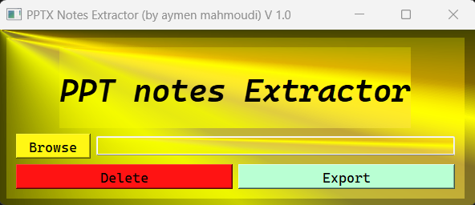

# PPT Notes Extractor

## Description
You may need to extract notes from PowerPoint presentations, so you can save them as text or print them. This project will provide a python script and a GUI to fill this need.

## Usage
The easiest way is to use the exe file from the bin folder (under W64). Otherwise, you can run the main file to launch the GUI (I recommend to setup a python 3.8 virtual environment) or the Notes_gen.py file after editing the ppt/pptx file path.

## Roadmap
 <ul>
  <li>Handle multiple ppt/pptx files at once</li>
  <li>Avoid the crash of the app in case of empty value</li>
  <li>Transform the project on a desktop application or create a PyPI package</li>
  <li>Create an online version</li>
</ul> 

## Support and Contributing
Let me know if you have any suggestions/ideas to enhance those scripts or add further settings. I want you to know that your suggestions are warmly appreciated.
 
 
In case of a problem, it is strongly recommended that an issue be posted. For a more confidential demand, don't hesitate to email me.

