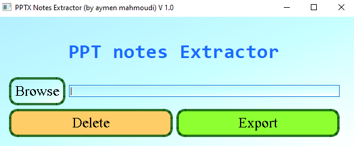

# PPT Notes Extractor


## Description

**PPT Notes Extractor** is a lightweight tool designed to extract speaker notes from PowerPoint presentations (`.ppt` / `.pptx`) and save them as plain text files.  
This helps users quickly review or print notes.


## Usage

1. **Browse** to select the PowerPoint (`.ppt` or `.pptx`) file.  
2. Click the **Export** button to extract and save the notes as a text file.  
3. Click the **Delete** button to save a copy of the PowerPoint file **without notes**.

<br>



---

## Installation

1. Clone or download this repository.
2. Install the required libraries using:

   ```console
   pip install -r requirements.txt
   ```

3. Run the `main.py` script from the `src` folder:

   ```console
   python src/main.py
   ```

> **Note:** The GUI has been tested with Python 3.8.
It is recommended to use a Python 3.8 virtual environment.
You can also run the Notes_gen.py file directly if you prefer to use the script instead of the GUI.


## Roadmap
 <ul>
  <li>Handle multiple ppt/pptx files at once</li>
  <li>Avoid the crash of the app in case of empty value</li>
  <li>Transform the project on a desktop application or create a PyPI package</li>
  <li>Create an online version</li>
</ul> 


## Support and Contributing
If you encounter any issues, please open an issue on GitHub. For confidential matters, feel free to email me directly. Suggestions and ideas for enhancing the scripts or adding features are warmly appreciated!  

